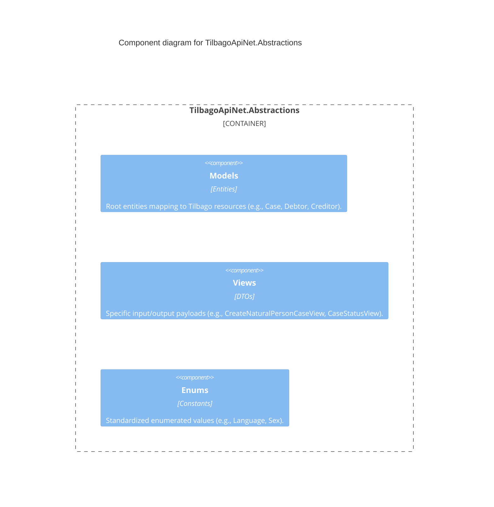

# Component Diagram: TilbagoApiNet.Abstractions

This package contains no business logic. It provides the Type definitions for payloads sent to and from the Tilbago API.

## Diagram

## Key Components

- **`Models`**: 
  - `Case`: The primary resource in Tilbago representing a debt collection case.
  - `Debtor`, `Creditor`, `ResponsiblePerson`: Person/entity objects linked to a case.
  - `Claim`: Represents the financial demand.
- **`Views`**: 
  - Used for specific request structures where a full `Case` object may be too verbose or requires specific validation formats (e.g. `CreateLegalPersonCaseView`). 
  - The `ErrorModel` maps upstream 4xx/5xx responses to manageable objects.
- **`Enums`**: 
  - Strongly typed alternatives to magic strings required by the Tilbago API.