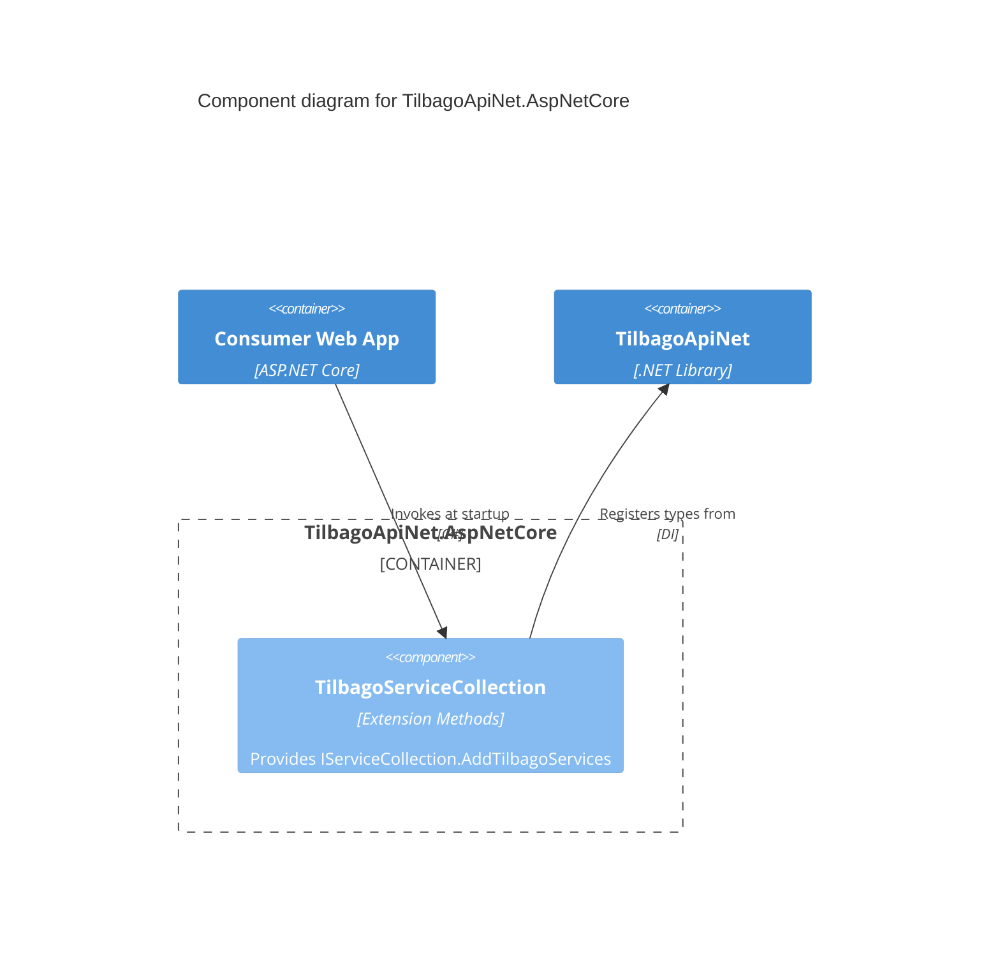

# Component Diagram: TilbagoApiNet.AspNetCore

A helper package for standardizing dependency injection in ASP.NET Core applications.

## Diagram

## Key Components

- **`TilbagoServiceCollection`**: Contains static extension methods for `IServiceCollection`.
  - Registers `TilbagoConfiguration` as a Singleton.
  - Registers `ITilbagoConnectionHandler` as Scoped.
  - Registers `ITilbagoApiClient` as Scoped.

By scoping the client and connection handler, the library natively supports request-scoped scenarios common in web applications, without retaining stale connections unnecessarily.