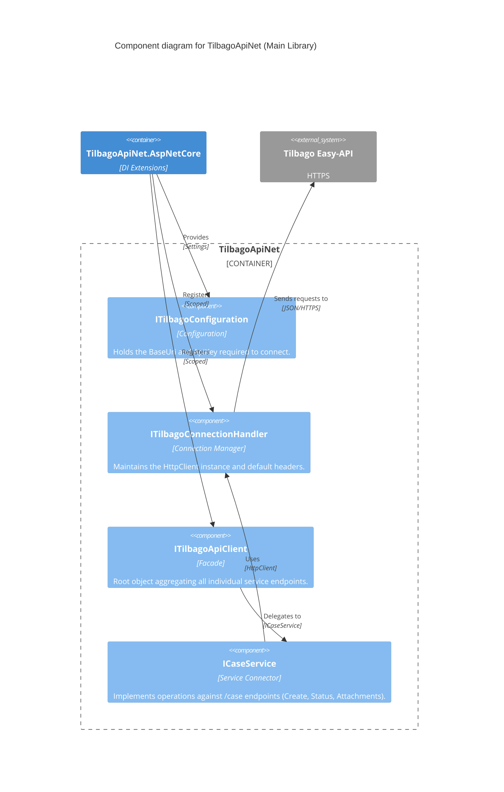

# Component Diagram: TilbagoApiNet (Main Library)

The main library manages the HTTP lifecycle and aggregates API connectors.

## Diagram

## Key Components

- **`ITilbagoApiClient` / `TilbagoApiClient`**: The main entry point. Exposes `CaseService`.
- **`ITilbagoConnectionHandler` / `TilbagoConnectionHandler`**: Centralizes `HttpClient` creation. Sets the `BaseAddress` and injects the `api_key` header from the provided configuration. Implements `IDisposable` to properly dispose the underlying client.
- **`ICaseService` / `CaseService`**: Responsible for serialization, API path formatting (`/case`, `/case/{id}/status`), and deserializing responses. Translates specific views (like `CreateNaturalPersonCaseView`) into the underlying `Case` model before transmitting.