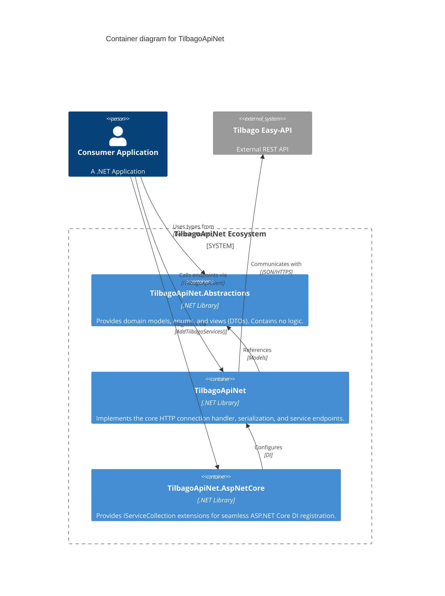

# Container Diagram: TilbagoApiNet Packages

The TilbagoApiNet system is broken down into modular packages (containers in C4 terminology) delivered as NuGet packages. This follows the AMANDA-Technology ApiNet pattern.

## Diagram

## Packages

| Container | Technology | Responsibility |
|-----------|------------|----------------|
| **[[tilbagoapinet]]** (`src/TilbagoApiNet`) | C# / .NET | The core execution layer. Holds the connection handler, HTTP client, and connector implementations mapping to the upstream endpoints. |
| **[[abstractions]]** (`src/TilbagoApiNet.Abstractions`) | C# / .NET | Shared definitions. Holds the `Case`, `Creditor`, `Debtor` models, enumerations, and specific view models used in requests/responses. |
| **[[aspnetcore]]** (`src/TilbagoApiNet.AspNetCore`) | C# / .NET | Integration layer. Contains the `TilbagoServiceCollection` for dependency injection inside modern ASP.NET Core apps. |