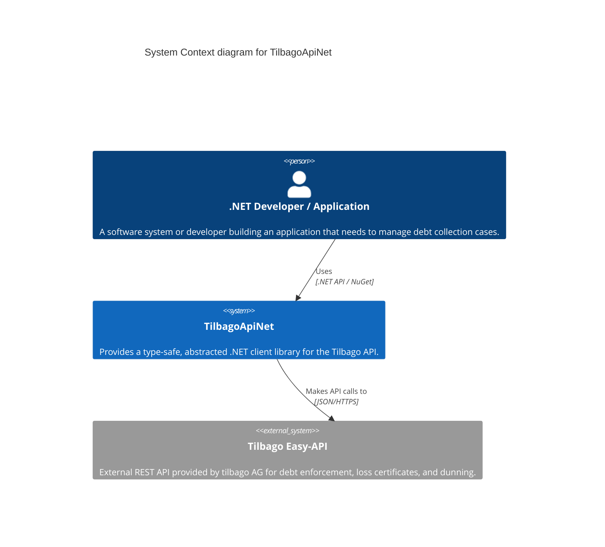

# System Context: TilbagoApiNet

TilbagoApiNet acts as a bridge between .NET-based applications (developed by AMANDA-Technology or external consumers) and the Tilbago Easy-API platform, enabling automated debt enforcement and loss certificate processing.

## Diagram

## Actors & External Systems

| Name | Type | Description |
|------|------|-------------|
| **.NET Developer / Application** | Actor | The system or individual integrating this library to programmatically manage debt collection workflows. |
| **TilbagoApiNet** | System | The .NET library being documented here. |
| **Tilbago Easy-API** | External System | The upstream service provided by tilbago AG. Manages the lifecycle of a debt collection case in Switzerland. |